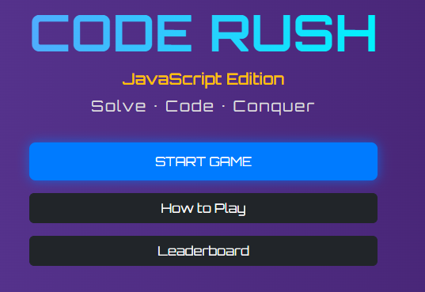
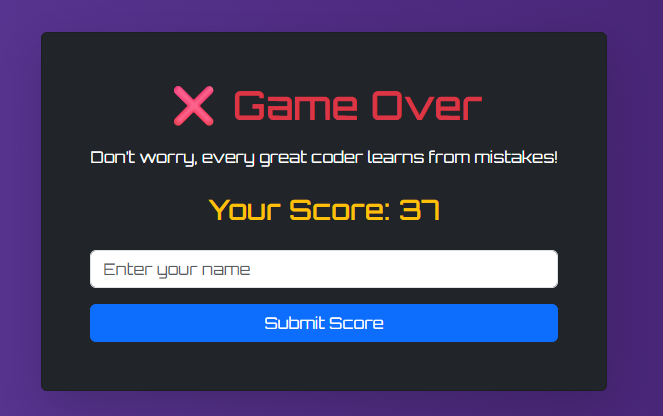

# ⚡ CodeRush

A fun coding challenge game with 3 levels:
- 🟢 Beginner: Multiple-choice JavaScript questions
- 🔵 Intermediate: Fill-in-the-blank questions
- 🔴 Pro: Small function-writing challenges with test cases

Players earn points based on correctness and remaining time.  
When a game ends, players submit their name + score → saved in MongoDB → shown in a live leaderboard.

---

## 🚀 Features
- 3 difficulty levels (Beginner, Intermediate, Pro)
- Timed gameplay with instant feedback
- Game Over & Level Complete screens
- Leaderboard (Top 10 scores from MongoDB)
- MongoDB + Express backend
- React (Vite) frontend with Bootstrap UI

---

## 🛠 Tech Stack
- **Frontend**: React + Vite + Bootstrap
- **Backend**: Node.js + Express
- **Database**: MongoDB (Mongoose)
- **Environment**: dotenv for secrets

---

## 📂 Project Structure
```

CodeRush/
│
├── backend/                # Express + MongoDB
│   ├── controller/
│   │   └── leaderBoard.js  # Leaderboard API
│   ├── models/
│   │   └── Score.js        # Mongo schema
│   ├── dbConnect.js        # Mongo connection
│   ├── server.js           # Express entry
│   └── .env                # Backend secrets (MONGODB_URL, PORT)
│
├── frontend/               # React (Vite)
│   ├── src/
│   │   ├── pages/          # Game pages (GamePlay, GameOver, LevelComplete, LeaderBoard)
│   │   ├── data/Questions.js
│   │   └── main.jsx
│   ├── index.html
│   └── vite.config.js
│
└── README.md

````

---

## ⚙️ Setup

### 1. Clone Repo
```
git clone https://github.com/yourusername/coderush.git
cd coderush
````

### 2. Backend Setup

```
cd backend
npm install
```

Create a `.env` file inside `/backend`:

```env
PORT=5000
MONGODB_URL=mongodb+srv://<username>:<password>@cluster.mongodb.net/coderush
```

Run backend:

```
npm run dev   
# or
npm start # if using nodemon
```

### 3. Frontend Setup

```
cd ../frontend
npm install
npm run dev
```

The frontend runs on **[http://localhost:5173](http://localhost:5173)**
Backend runs on **[http://localhost:5555](http://localhost:5000)**

---

## 🌐 API Endpoints

* **POST /api/leaderboard** → save player score `{ name, score }`
* **GET /api/leaderboard** → fetch top 10 scores

---

## 📸 Screens

* 🕹 Gameplay
* ❌ Game Over
* 🎉 Level Complete
* 🏆 Leaderboard





## 👨‍💻 Author

Built with ❤️ by Anas Hussain

```

